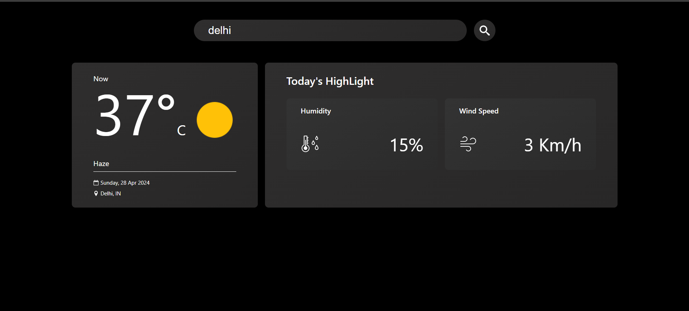
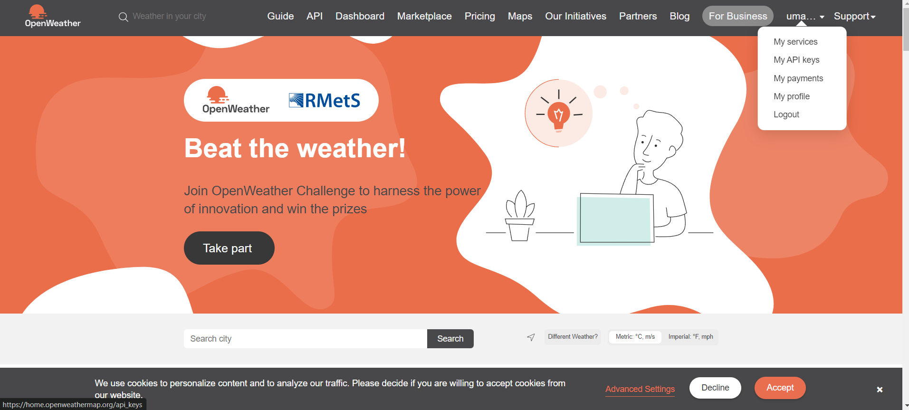

# Getting Started with Create React App


## Guide to add open weather API key:
1. Login into the https://openweathermap.org/
2. Click on the profile in the navigation bar.
3. Click on the my api key from the dropdown menu.

4. Copy the api key if it already present else generate new key
5. Paste the api key in the .env file

## To run the project on Local machine:

Please install nvm on your system before running this project
Node version : `v16.13.0`
Npm version : `v8.1.0`

### Base setup

```
nvm use v16.13.0
npm install or npm i
```

### For local development

```
npm start
```

### For production build

``` 
npm run build
```